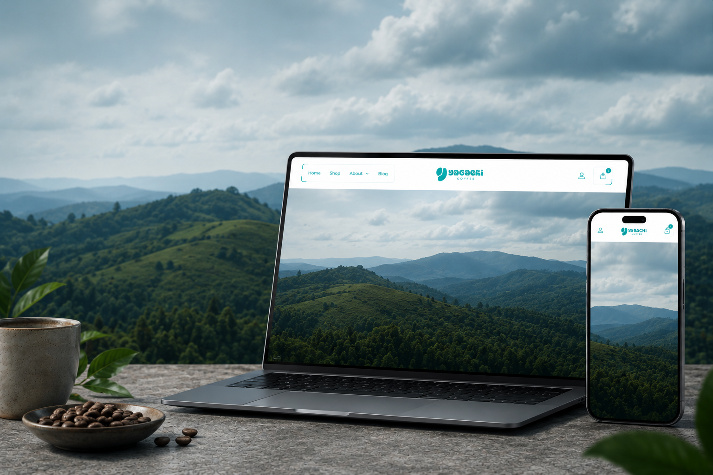
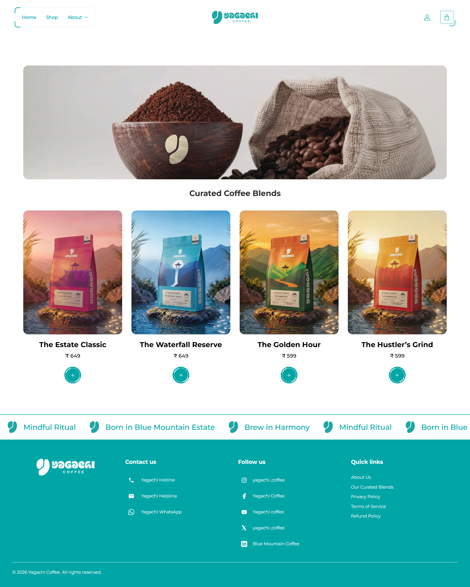
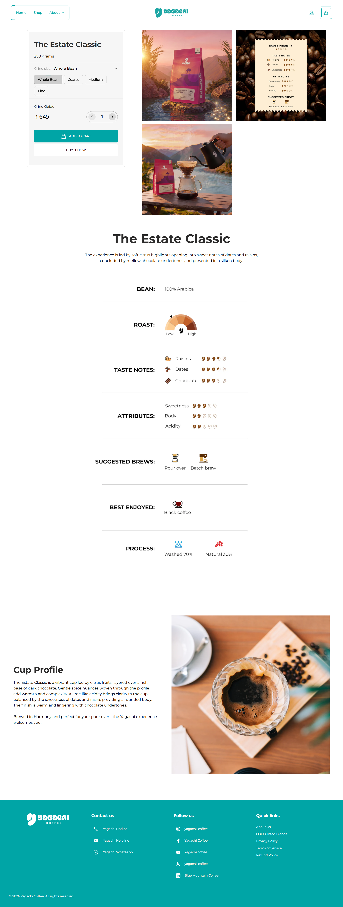

# ☕ Yagachi Coffee

### Designing & Developing a Premium Shopify Experience

A premium Shopify storefront designed to reflect the craftsmanship and philosophy of Yagachi Coffee through clean design, responsive development, and thoughtful user experiences.

---

# Project Overview

Yagachi Coffee is a specialty coffee brand inspired by the calm flow of the Yagachi River.

The objective of this project was to translate the brand's identity into a modern Shopify storefront that balances storytelling, usability, and performance while providing a seamless shopping experience across every device.

---

# Project Information

| Category | Details |
|----------|---------|
| Platform | Shopify |
| Industry | Coffee & Beverage |
| Role | Website Developer |
| Duration | February 2026 – May 2026 |
| Status | Completed |

---

# Highlights

- Premium Shopify storefront
- Responsive design
- Custom Shopify sections
- Optimised collection & product pages
- Performance-focused implementation
- Brand-focused user experience
- SEO-friendly structure

---

# Homepage

The homepage introduces visitors through immersive visuals and generous white space, creating a calm first impression before encouraging product discovery.

---

# Collection Experience

The collection page was simplified to help customers discover coffee naturally. Rather than displaying every grind variation as separate products, customers first select a coffee before choosing their preferred grind size inside the product page.

---

# Product Experience

Every product page combines storytelling with essential purchasing information, allowing customers to understand the coffee's origin, roast profile, tasting notes, and brewing details before making a purchase.

---

# About Yagachi

The About page extends the brand philosophy beyond products, introducing visitors to the people, landscape, and values behind every cup.

---

# Tech Stack

- Shopify
- Shopify Liquid
- HTML5
- CSS3
- JavaScript
- Responsive Web Design

---

# Live Website

🌐 https://yagachi.coffee

---

### Designed & Developed by Harish T

If you enjoyed exploring this project, feel free to connect with me.

- 💼 LinkedIn: https://www.linkedin.com/in/harish-t-293567365
